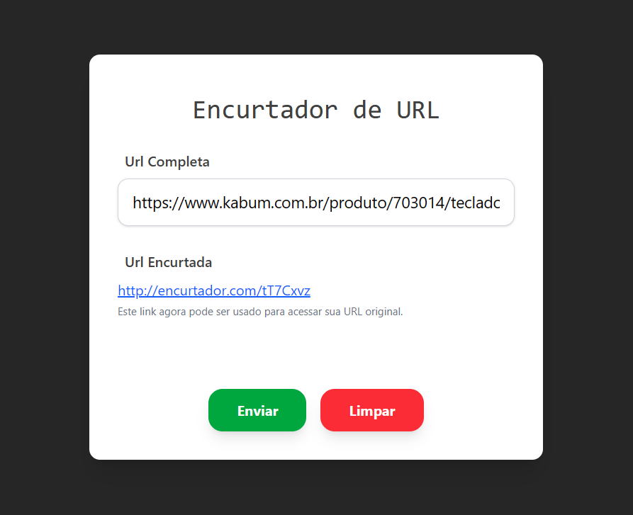

# Encurtador de URL (Fullstack)

Este é um projeto fullstack desenvolvido para encurtar URLs longas de forma rápida e eficiente. O sistema gera um código único para cada link e gerencia o redirecionamento automático através de uma API robusta.

- Confira o desafio clicando [aqui](./PROBLEM.md)
---

##  Tecnologias Utilizadas

### **Back-end**
* **Node.js** com **Fastify**: Framework web de alta performance.
* **Prisma ORM**: Gerenciamento de banco de dados e consultas.
* **TypeScript**: Tipagem estática para maior segurança no código.
* **CORS**: Configurado para permitir a comunicação segura com o Front-end.

### **Front-end**
* **React**: Biblioteca para construção da interface.
* **Tailwind CSS**: Estilização moderna e responsiva baseada em utilitários.

---

## Como Funciona?

1.  **Encurtamento:** O usuário insere uma URL longa no Front-end.
2.  **Processamento:** O Back-end gera um código único (ex: `abcd123`), valida a unicidade e salva no banco de dados com uma data de expiração.
3.  **Redirecionamento:** Ao clicar no link curto gerado, o servidor Fastify identifica o código, busca a URL original no banco e realiza um redirecionamento automático.

## Prévia do funcionamento

### Tela Principal

